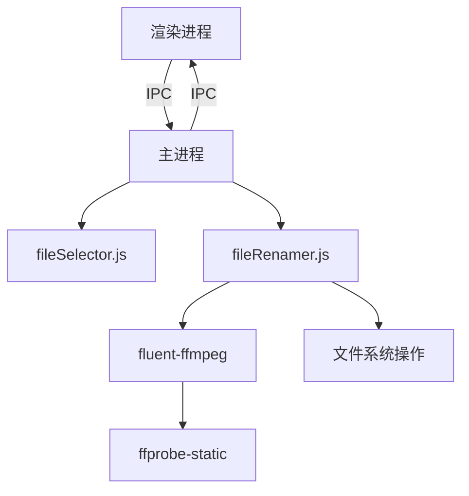
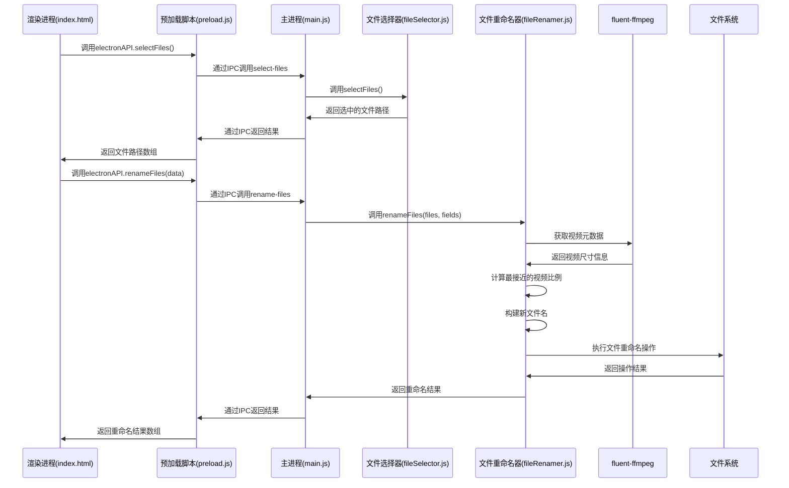

# 视频素材批量改名工具开发文档

## 1. 项目概述

### 1.1 项目背景与目标

视频素材批量改名工具是一个基于Electron开发的桌面应用程序，旨在解决视频制作工作流中的文件管理问题。在视频制作过程中，素材文件的命名规范对于团队协作和资源管理至关重要。本工具允许用户选择多个视频文件，填写相关信息（如产品名、模板名等），然后根据预定义的命名规则自动重命名这些文件，从而提高工作效率并确保命名一致性。

### 1.2 技术栈概览

本项目采用以下技术栈：

- **前端**：
  - HTML：构建用户界面
  - JavaScript（原生）：实现界面交互逻辑

- **后端**：
  - Node.js：提供文件系统操作和视频处理能力
  - Electron：实现桌面应用程序框架，提供跨平台支持

- **依赖库**：
  - fluent-ffmpeg (v2.1.3)：用于获取视频文件的元数据（如分辨率）
  - ffprobe-static (v3.1.0)：提供ffprobe的静态二进制文件，用于视频分析

### 1.3 系统功能概述

- 选择多个视频文件
- 填写相关信息（产品名、模板名、视频名、制作人、时长）
- 自动检测视频比例
- 根据预定义规则生成新文件名
- 处理文件名冲突
- 执行批量重命名操作
- 显示重命名结果

### 1.4 项目结构

```
assets-rename/
├── docs/
│   └── 素材命名规则.md    # 命名规则文档
├── index.html            # 主界面
├── main.js               # Electron主进程
├── preload.js            # 预加载脚本
├── fileSelector.js       # 文件选择模块
├── fileRenamer.js        # 文件重命名模块
├── package.json          # 项目配置
└── package-lock.json     # 依赖锁定文件
```

## 2. 架构设计

### 2.1 系统架构图



### 2.2 数据流程图



### 2.3 模块间通信机制

本项目采用Electron的IPC（进程间通信）机制实现渲染进程和主进程之间的通信：

1. **渲染进程到主进程**：
   - 通过`ipcRenderer.invoke(channel, ...args)`发送请求
   - 在预加载脚本中通过`contextBridge.exposeInMainWorld`暴露API

2. **主进程到渲染进程**：
   - 通过`ipcMain.handle(channel, handler)`注册处理程序
   - 处理程序返回的Promise结果会被传回渲染进程

### 2.4 核心设计模式与原则

1. **模块化设计**：
   - 将功能划分为独立模块（文件选择、文件重命名）
   - 每个模块专注于单一职责

2. **安全性考虑**：
   - 使用上下文隔离（contextIsolation: true）
   - 禁用Node集成（nodeIntegration: false）
   - 通过预加载脚本安全地暴露API

3. **异步操作处理**：
   - 使用Promise和async/await处理异步操作
   - 确保UI响应性和操作可靠性

## 3. 功能模块详解

### 3.1 主进程模块（main.js）

主进程是Electron应用的入口点，负责创建窗口、处理应用生命周期和注册IPC处理程序。

#### 3.1.1 核心功能

```javascript
// 创建应用窗口
function createWindow() {
  const win = new BrowserWindow({
    width: 800,
    height: 600,
    webPreferences: {
      preload: path.join(__dirname, 'preload.js'),
      nodeIntegration: false,
      contextIsolation: true
    }
  });
  win.loadFile('index.html');
}
```

这个函数创建了应用的主窗口，设置了窗口大小和安全相关的Web首选项，然后加载`index.html`文件。

#### 3.1.2 应用生命周期管理

```javascript
app.whenReady().then(() => {
  createWindow();

  app.on('activate', function () {
    if (BrowserWindow.getAllWindows().length === 0) createWindow();
  });
});

app.on('window-all-closed', function () {
  if (process.platform !== 'darwin') app.quit();
});
```

这段代码处理应用的生命周期事件：
- `whenReady`：应用初始化完成后创建窗口
- `activate`：在macOS上，点击Dock图标时如果没有窗口则创建新窗口
- `window-all-closed`：在非macOS平台上，所有窗口关闭时退出应用

#### 3.1.3 IPC处理程序

```javascript
ipcMain.handle('select-files', async () => {
  return await selectFiles();
});

ipcMain.handle('rename-files', async (event, data) => {
  return await renameFiles(data.files, data.fields);
});
```

这里注册了两个IPC处理程序：
- `select-files`：调用`fileSelector.js`中的`selectFiles`函数
- `rename-files`：调用`fileRenamer.js`中的`renameFiles`函数，传入文件路径和表单字段

### 3.2 预加载脚本（preload.js）

预加载脚本在渲染进程中安全地暴露主进程API，确保渲染进程不能直接访问Node.js API。

#### 3.2.1 API暴露

```javascript
contextBridge.exposeInMainWorld('electronAPI', {
  selectFiles: () => ipcRenderer.invoke('select-files'),
  renameFiles: (data) => ipcRenderer.invoke('rename-files', data)
});
```

这段代码通过`contextBridge.exposeInMainWorld`在渲染进程中暴露了两个API：
- `selectFiles`：调用主进程的`select-files`处理程序
- `renameFiles`：调用主进程的`rename-files`处理程序，传入数据对象

### 3.3 文件选择模块（fileSelector.js）

文件选择模块负责打开文件选择对话框，让用户选择视频文件。

#### 3.3.1 API接口

```javascript
/**
 * 打开文件选择对话框，允许用户选择多个视频文件
 * @returns {Promise<string[]>} 返回选中文件的路径数组，如果用户取消则返回空数组
 */
async function selectFiles() {
  // 实现代码...
}
```

#### 3.3.2 实现细节

```javascript
async function selectFiles() {
  const result = await dialog.showOpenDialog({
    properties: ['openFile', 'multiSelections'],
    filters: [
      { name: '视频文件', extensions: ['mp4', 'mov', 'avi', 'mkv', 'flv', 'wmv', 'webm'] }
    ]
  });
  if (result.canceled) {
    return [];
  } else {
    return result.filePaths;
  }
}
```

这个函数使用Electron的`dialog.showOpenDialog`API打开文件选择对话框：
- `properties`：设置对话框属性，允许选择文件和多选
- `filters`：设置文件过滤器，只显示指定扩展名的视频文件
- 返回值：如果用户取消选择，返回空数组；否则返回选中文件的路径数组

### 3.4 文件重命名模块（fileRenamer.js）

文件重命名模块是应用的核心功能模块，负责获取视频元数据、生成新文件名和执行重命名操作。

#### 3.4.1 API接口

```javascript
/**
 * 批量重命名视频文件
 * @param {string[]} filePaths - 要重命名的文件路径数组
 * @param {Object} fields - 表单字段对象
 * @param {string} fields.product - 产品名
 * @param {string} fields.template - 模板名
 * @param {string} fields.video - 视频名
 * @param {string} fields.author - 制作人
 * @param {string} fields.duration - 时长（秒）
 * @returns {Promise<Array<{oldPath: string, newPath: string, success: boolean, error?: string}>>}
 *          重命名结果数组，包含每个文件的原路径、新路径、是否成功和错误信息
 */
async function renameFiles(filePaths, fields) {
  // 实现代码...
}
```

#### 3.4.2 辅助函数

```javascript
/**
 * 获取当前日期字符串，格式为YYMMDD
 * @returns {string} 日期字符串
 */
function getTodayStr() {
  const now = new Date();
  const yy = String(now.getFullYear()).slice(-2);
  const mm = String(now.getMonth() + 1).padStart(2, '0');
  const dd = String(now.getDate()).padStart(2, '0');
  return `${yy}${mm}${dd}`;
}

/**
 * 根据视频宽高比确定最接近的标准比例
 * @param {number|null} width - 视频宽度
 * @param {number|null} height - 视频高度
 * @returns {string} 标准比例名称（如"916"、"169"等）
 */
function getNearestRatio(width, height) {
  if (!width || !height) return '未知';
  const actual = width / height;
  let minDiff = Infinity;
  let nearest = '未知';
  for (const r of ratioList) {
    const diff = Math.abs(actual - r.value);
    if (diff < minDiff) {
      minDiff = diff;
      nearest = r.name;
    }
  }
  return nearest;
}

/**
 * 从文件名中提取语言代码
 * @param {string} filePath - 文件路径
 * @returns {string|null} 提取的语言代码，如果没有找到则返回null
 */
function extractLanguageCode(filePath) {
  // 从文件名中提取语言代码，格式为[xx]，如[en]、[zh]、[fr]等
  const fileName = path.basename(filePath);
  const match = fileName.match(/\[([a-z]{2})\]/i);
  return match ? match[1].toLowerCase() : null;
}

/**
 * 根据命名规则构建新文件名
 * @param {Object} fields - 表单字段对象
 * @param {string} ext - 文件扩展名
 * @param {string} ratio - 视频比例
 * @param {string} language - 语言代码
 * @returns {string} 新文件名
 */
function buildName(fields, ext, ratio, language) {
  return `${getTodayStr()}_P-${fields.product}_T-${fields.template}_C-${fields.video}_S-${ratio}_L-${language}_D-${fields.author}_M-${fields.duration}${ext}`;
}

/**
 * 处理文件名冲突，确保新文件名不重复
 * @param {string} dir - 目录路径
 * @param {string} baseName - 基本文件名（不含扩展名）
 * @param {string} ext - 文件扩展名
 * @returns {string} 不重复的文件名
 */
function getNonDuplicateName(dir, baseName, ext) {
  let name = `${baseName}${ext}`;
  let counter = 1;
  while (fs.existsSync(path.join(dir, name))) {
    name = `${baseName}(${counter})${ext}`;
    counter++;
  }
  return name;
}

/**
 * 获取视频文件的尺寸信息
 * @param {string} filePath - 视频文件路径
 * @returns {Promise<{width: number|null, height: number|null}>} 视频尺寸对象
 */
function getVideoSize(filePath) {
  return new Promise((resolve, reject) => {
    ffmpeg.ffprobe(filePath, (err, metadata) => {
      if (err) return resolve({ width: null, height: null });
      const stream = metadata.streams.find(s => s.width && s.height);
      if (stream) {
        resolve({ width: stream.width, height: stream.height });
      } else {
        resolve({ width: null, height: null });
      }
    });
  });
}
```

#### 3.4.3 实现细节

```javascript
async function renameFiles(filePaths, fields) {
  const results = [];
  for (let i = 0; i < filePaths.length; i++) {
    const oldPath = filePaths[i];
    const dir = path.dirname(oldPath);
    const ext = path.extname(oldPath);
    // 检测视频尺寸
    const { width, height } = await getVideoSize(oldPath);
    const ratio = getNearestRatio(width, height);
    const baseName = buildName(fields, '', ratio);
    const newName = getNonDuplicateName(dir, baseName, ext);
    const newPath = path.join(dir, newName);
    try {
      await fs.promises.rename(oldPath, newPath);
      results.push({ oldPath, newPath, success: true });
    } catch (err) {
      results.push({ oldPath, newPath, success: false, error: err.message });
    }
  }
  return results;
}
```

这个函数实现了文件重命名的核心逻辑：
1. 遍历所有选中的文件
2. 获取文件所在目录和扩展名
3. 使用ffmpeg获取视频尺寸信息
4. 根据视频宽高比确定最接近的标准比例
5. 根据命名规则构建新文件名
6. 处理文件名冲突，确保新文件名不重复
7. 执行文件重命名操作
8. 返回重命名结果

### 3.5 用户界面（index.html）

用户界面是应用的前端部分，包含HTML结构和JavaScript交互逻辑。

#### 3.5.1 HTML结构

```html
<!DOCTYPE html>
<html lang="zh-CN">
<head>
  <meta charset="UTF-8">
  <meta http-equiv="X-UA-Compatible" content="IE=edge">
  <meta name="viewport" content="width=800, initial-scale=1.0">
  <title>批量重命名工具</title>
</head>
<body>
  <h1>欢迎使用批量重命名工具</h1>
  <button id="select-files">选择文件</button>
  <button id="rename-files">批量重命名</button>
  <div id="file-list"></div>
  <form id="rename-form" style="margin-bottom: 10px;">
    <label>产品名：<input type="text" id="product" required></label>
    <label>模板名：<input type="text" id="template" required></label>
    <label>视频名：<input type="text" id="video" required></label>
    <label>制作人：<input type="text" id="author" required></label>
    <label>时长（秒）：<input type="text" id="duration" required></label>
  </form>
  <p>后续功能将逐步完善。</p>
  <!-- JavaScript代码 -->
</body>
</html>
```

界面包含以下元素：
- 标题和说明文本
- "选择文件"和"批量重命名"按钮
- 文件列表显示区域
- 表单，用于输入产品名、模板名、视频名、制作人和时长

#### 3.5.2 JavaScript交互逻辑

```javascript
let selectedFiles = [];
document.getElementById('select-files').addEventListener('click', async () => {
  const files = await window.electronAPI.selectFiles();
  selectedFiles = files;
  const fileListDiv = document.getElementById('file-list');
  if (files && files.length > 0) {
    fileListDiv.innerHTML = '<b>已选择文件：</b><br>' + files.map(f => `<div>${f}</div>`).join('');
  } else {
    fileListDiv.innerHTML = '<i>未选择文件</i>';
  }
});
document.getElementById('rename-files').addEventListener('click', async () => {
  if (!selectedFiles || selectedFiles.length === 0) {
    alert('请先选择文件！');
    return;
  }
  const product = document.getElementById('product').value.trim();
  const template = document.getElementById('template').value.trim();
  const video = document.getElementById('video').value.trim();
  const author = document.getElementById('author').value.trim();
  const duration = document.getElementById('duration').value.trim();
  if (!product || !template || !video || !author || !duration) {
    alert('请填写所有字段！');
    return;
  }
  const fields = { product, template, video, author, duration };
  const result = await window.electronAPI.renameFiles({ files: selectedFiles, fields });
  let html = '<b>重命名结果：</b><br>';
  result.forEach(r => {
    if (r.success) {
      html += `<div style="color:green">${r.oldPath} → ${r.newPath}</div>`;
    } else {
      html += `<div style="color:red">${r.oldPath} 重命名失败：${r.error}</div>`;
    }
  });
  document.getElementById('file-list').innerHTML = html;
  selectedFiles = [];
});
```

这段代码实现了两个主要功能：
1. **选择文件**：
   - 点击"选择文件"按钮调用`window.electronAPI.selectFiles()`
   - 将返回的文件路径存储在`selectedFiles`变量中
   - 在页面上显示已选择的文件列表

2. **批量重命名**：
   - 点击"批量重命名"按钮首先验证是否已选择文件和填写所有字段
   - 收集表单数据，构建`fields`对象
   - 调用`window.electronAPI.renameFiles()`，传入文件路径和字段数据
   - 处理返回的结果，以颜色编码显示（成功为绿色，失败为红色）
   - 清空`selectedFiles`变量

### 3.6 各模块API接口文档

#### 3.6.1 electronAPI（预加载脚本暴露的API）

| 方法 | 参数 | 返回值 | 描述 |
|------|------|--------|------|
| `selectFiles()` | 无 | `Promise<string[]>` | 打开文件选择对话框，返回选中文件的路径数组 |
| `renameFiles(data)` | `data: {files: string[], fields: Object}` | `Promise<Array<{oldPath: string, newPath: string, success: boolean, error?: string}>>` | 批量重命名文件，返回重命名结果数组 |

#### 3.6.2 fileSelector.js

| 方法 | 参数 | 返回值 | 描述 |
|------|------|--------|------|
| `selectFiles()` | 无 | `Promise<string[]>` | 打开文件选择对话框，返回选中文件的路径数组 |

#### 3.6.3 fileRenamer.js

| 方法 | 参数 | 返回值 | 描述 |
|------|------|--------|------|
| `renameFiles(filePaths, fields)` | `filePaths: string[]`, `fields: Object` | `Promise<Array<{oldPath: string, newPath: string, success: boolean, error?: string}>>` | 批量重命名文件，返回重命名结果数组 |
| `getTodayStr()` | 无 | `string` | 获取当前日期字符串，格式为YYMMDD |
| `getNearestRatio(width, height)` | `width: number\|null`, `height: number\|null` | `string` | 根据视频宽高比确定最接近的标准比例 |
| `extractLanguageCode(filePath)` | `filePath: string` | `string\|null` | 从文件名中提取语言代码，格式为[xx]，如[en]、[zh]等 |
| `buildName(fields, ext, ratio, language)` | `fields: Object`, `ext: string`, `ratio: string`, `language: string` | `string` | 根据命名规则构建新文件名 |
| `getNonDuplicateName(dir, baseName, ext)` | `dir: string`, `baseName: string`, `ext: string` | `string` | 处理文件名冲突，确保新文件名不重复 |
| `getVideoSize(filePath)` | `filePath: string` | `Promise<{width: number\|null, height: number\|null}>` | 获取视频文件的尺寸信息 |
## 4. 核心算法实现

### 4.1 视频比例检测算法

视频比例检测算法的核心是计算视频的宽高比，然后找出最接近的标准比例。

```javascript
const ratioList = [
  { name: '916', value: 9 / 16 },
  { name: '169', value: 16 / 9 },
  { name: '11', value: 1 },
  { name: '45', value: 4 / 5 },
  { name: '34', value: 3 / 4 },
  { name: '43', value: 4 / 3 }
];

function getNearestRatio(width, height) {
  if (!width || !height) return '未知';
  const actual = width / height;
  let minDiff = Infinity;
  let nearest = '未知';
  for (const r of ratioList) {
    const diff = Math.abs(actual - r.value);
    if (diff < minDiff) {
      minDiff = diff;
      nearest = r.name;
    }
  }
  return nearest;
}
```

算法步骤：
1. 定义标准比例列表，包含常见的视频比例（9:16、16:9、1:1等）
2. 计算实际视频的宽高比
3. 遍历标准比例列表，计算每个标准比例与实际比例的差值
4. 选择差值最小的标准比例作为结果

### 4.2 文件命名规则实现

文件命名规则按照特定格式生成新文件名：

```javascript
function buildName(fields, ext, ratio, language) {
  return `${getTodayStr()}_P-${fields.product}_T-${fields.template}_C-${fields.video}_S-${ratio}_L-${language}_D-${fields.author}_M-${fields.duration}${ext}`;
}
```

命名格式：`YYMMDD_P-产品名_T-模板名_C-视频名_S-视频比例_L-语言代码_D-制作人_M-时长.扩展名`

其中：
- 日期自动生成（当前日期）
- 产品名、模板名、视频名、制作人和时长由用户输入
- 视频比例自动从视频文件中检测
- 语言代码可以从文件名中自动提取（如果文件名包含[en]、[zh]等格式的语言代码），如果没有则默认使用"unknown"（方便用户识别没有正确设置语言代码的文件）

### 4.3 文件名冲突处理

为了避免文件名冲突，应用实现了一个简单的冲突处理算法：

```javascript
function getNonDuplicateName(dir, baseName, ext) {
  let name = `${baseName}${ext}`;
  let counter = 1;
  while (fs.existsSync(path.join(dir, name))) {
    name = `${baseName}(${counter})${ext}`;
    counter++;
  }
  return name;
}
```

算法步骤：
1. 尝试使用原始文件名
2. 如果文件已存在，则在文件名后添加递增的数字后缀，如`(1)`、`(2)`等
3. 重复步骤2，直到找到一个不存在的文件名

## 5. 开发环境配置

### 5.1 依赖项安装

项目依赖Node.js环境，可以通过以下步骤安装依赖项：

```bash
# 克隆项目
git clone https://github.com/qq7qsss245/assets-rename.git
cd assets-rename

# 安装依赖
npm install
```

主要依赖项：
- electron (v36.2.0)：Electron框架
- fluent-ffmpeg (v2.1.3)：用于获取视频元数据
- ffprobe-static (v3.1.0)：提供ffprobe的静态二进制文件

### 5.2 开发环境搭建

开发环境需要安装Node.js和npm。推荐使用最新的LTS版本。

### 5.3 构建与打包说明

项目可以通过以下命令启动：

```bash
npm start
```

目前项目没有配置打包脚本。如需打包为可执行文件，可以使用electron-builder或electron-packager等工具。

## 6. 使用说明

### 6.1 功能操作流程

1. 启动应用
2. 点击"选择文件"按钮，选择要重命名的视频文件
3. 填写表单信息：
   - 产品名
   - 模板名
   - 视频名
   - 制作人
   - 时长（秒）
4. 点击"批量重命名"按钮，执行重命名操作
5. 查看重命名结果

### 6.2 输入字段说明

| 字段 | 描述 | 示例 |
|------|------|------|
| 产品名 | 产品或项目的名称 | Findit |
| 模板名 | 视频模板的名称 | tidyup |
| 视频名 | 视频的具体名称 | APFDtub2 |
| 制作人 | 视频制作者的名称 | Leah |
| 时长（秒） | 视频的时长，以秒为单位 | 30 |

### 6.3 常见问题与解决方案

1. **问题**：无法选择视频文件
   **解决方案**：确保文件扩展名是支持的视频格式（mp4、mov、avi、mkv、flv、wmv、webm）

2. **问题**：视频比例检测为"未知"
   **解决方案**：可能是视频文件损坏或格式不支持，尝试使用其他视频转换工具转换格式

3. **问题**：重命名失败
   **解决方案**：检查文件是否被其他程序占用，或者是否有足够的权限

## 7. 开发状态与限制

### 7.1 当前实现的功能

- 文件选择（支持多选）
- 基本信息输入
- 视频比例自动检测
- 按规则重命名
- 结果展示
- 文件名冲突处理

### 7.2 已知问题与限制

1. **功能限制**：
   - 语言选择功能已通过文件名约定实现（支持从文件名中提取[en]、[zh]等格式的语言代码）
   - 界面简陋，缺乏样式美化
   - 缺少输入验证和错误处理机制
   - 没有保存用户偏好设置的功能
   - 没有批处理历史记录

2. **技术限制**：
   - 使用原生JavaScript而非框架，可能限制未来扩展
   - 错误处理较简单，可能在复杂场景下不够健壮
   - 界面交互较为基础，用户体验有提升空间

### 7.3 技术债务

1. **代码组织**：
   - 缺少模块化和组件化设计
   - 缺少代码注释和文档
   - 缺少单元测试和集成测试

2. **依赖管理**：
   - 依赖版本可能需要更新
   - 缺少依赖版本锁定策略

## 8. 未来扩展与改进

### 8.1 功能扩展建议

1. **用户界面改进**：
   - 添加CSS样式，美化界面
   - 实现响应式设计，适应不同屏幕尺寸
   - 添加拖放功能，支持拖放文件

2. **功能增强**：
   - 改进语言选择功能，添加用户界面支持
   - 添加预览功能，在重命名前预览新文件名
   - 添加批处理历史记录
   - 添加用户偏好设置，保存常用字段值
   - 支持更多视频格式
   - 添加批量处理进度条

3. **数据管理**：
   - 添加数据持久化，保存用户设置和历史记录
   - 添加导入/导出功能，支持批量导入命名规则

### 8.2 代码重构建议

1. **架构优化**：
   - 采用MVC或MVVM架构模式
   - 使用前端框架（如React、Vue）重构界面
   - 将业务逻辑与UI分离

2. **模块化改进**：
   - 将功能拆分为更小的模块
   - 使用ES6模块系统
   - 实现插件系统，支持功能扩展

3. **测试与质量保证**：
   - 添加单元测试
   - 添加集成测试
   - 实现自动化构建和测试流程

### 8.3 性能优化方向

1. **文件处理优化**：
   - 实现并行处理，提高批量重命名效率
   - 优化视频元数据提取过程
   - 添加缓存机制，避免重复分析相同视频

2. **UI响应优化**：
   - 实现异步UI更新
   - 添加操作反馈和动画效果
   - 优化大量文件的显示方式

## 9. 附录

### 9.1 命名规则详解

根据`docs/素材命名规则.md`文件，视频素材的命名规则如下：

格式：`YYMMDD_P-产品名_T-模板名_C-视频名_S-视频比例_L-语言代码_D-制作人_M-时长.扩展名`

各字段说明：
- **YYMMDD**：日期，格式为年份后两位+月份+日期
- **P-产品名**：产品或项目的名称
- **T-模板名**：在同一模板里迭代的素材都使用同一模板名，一般自定义
- **C-视频名**：视频的具体名称，一般自定义
- **S-视频比例**：视频的宽高比，常见值有916、169、11、45等
- **L-语言代码**：en/de/fr/es/zh等，小写字母代码
- **D-制作人**：视频制作者的名称，多人用&连接
- **M-时长**：视频时长，多人制作时用&连接各自的制作时长

示例：
- `250327_P-Findit_T-tidyup_C-APFDtub2_S-916_L-en_VL-L-30_D-Leah&Arnold&Lelouch_M-1&1&1`
- `250509_P-NutsSort_T-88788wide_C-5colors4_VL-L-30_S-916_L-zh_D-Leah_M-1`

### 9.2 错误代码说明

目前应用没有定义标准的错误代码系统。在重命名失败时，会直接显示Node.js的错误消息。

### 9.3 参考资料

1. [Electron官方文档](https://www.electronjs.org/docs)
2. [fluent-ffmpeg文档](https://github.com/fluent-ffmpeg/node-fluent-ffmpeg)
3. [ffprobe-static文档](https://github.com/joshwnj/ffprobe-static)
4. [Node.js文件系统API](https://nodejs.org/api/fs.html)
5. [语言代码表](http://www.lingoes.cn/zh/translator/langcode.htm)