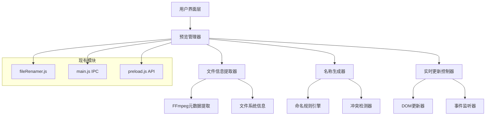
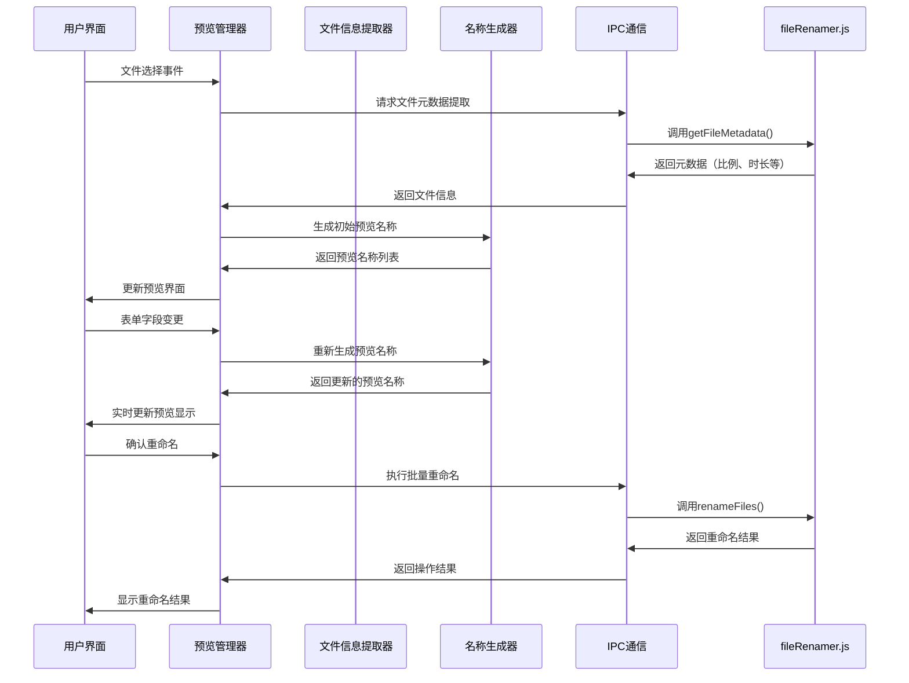
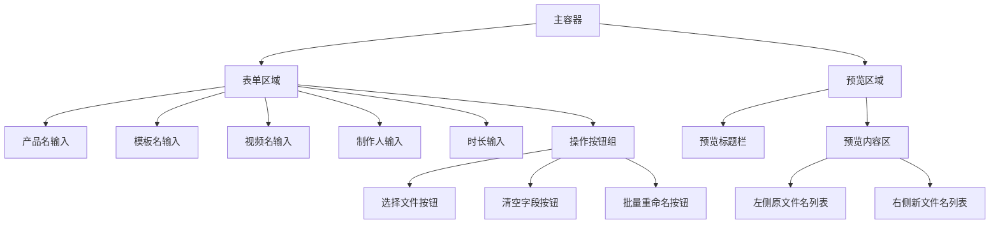

# 预览界面功能技术设计方案

## 1. 项目概述

### 1.1 设计目标
基于现有的视频素材批量改名工具，新增预览界面功能，实现：
- 文件选择后自动显示预览界面
- 左右分栏布局：左侧原文件名，右侧预览新文件名
- 实时响应用户输入，动态更新预览名称
- 替代原有的简单文件列表界面

### 1.2 核心需求
1. **实时预览**：用户填写表单时，预览名称实时更新
2. **自动获取参数**：系统自动获取视频比例、时长、语言等信息
3. **直观对比**：左右分栏清晰展示原名与新名对比
4. **无缝集成**：与现有工作流程完美融合

## 2. 系统架构设计

### 2.1 整体架构图



### 2.2 数据流程图



## 3. 界面设计方案

### 3.1 布局结构设计



### 3.2 界面布局详细设计

#### 3.2.1 整体布局
- **左侧（40%宽度）**：表单输入区域，保持现有设计
- **右侧（60%宽度）**：预览区域，替代原有文件列表

#### 3.2.2 预览区域结构
```html
<div class="preview-container">
    <div class="preview-header">
        <h5>文件重命名预览</h5>
        <span class="file-count">共 X 个文件</span>
    </div>
    <div class="preview-content">
        <div class="preview-columns">
            <div class="original-files">
                <h6>原文件名</h6>
                <div class="file-list original-list">
                    <!-- 原文件名列表 -->
                </div>
            </div>
            <div class="preview-files">
                <h6>预览新文件名</h6>
                <div class="file-list preview-list">
                    <!-- 预览文件名列表 -->
                </div>
            </div>
        </div>
    </div>
</div>
```

### 3.3 样式设计

#### 3.3.1 预览区域样式
```css
.preview-container {
    height: 100%;
    display: flex;
    flex-direction: column;
}

.preview-header {
    display: flex;
    justify-content: space-between;
    align-items: center;
    padding: 1rem;
    border-bottom: 1px solid #dee2e6;
    background-color: #f8f9fa;
}

.preview-content {
    flex: 1;
    overflow: hidden;
}

.preview-columns {
    display: flex;
    height: 100%;
}

.original-files,
.preview-files {
    flex: 1;
    display: flex;
    flex-direction: column;
}

.original-files {
    border-right: 1px solid #dee2e6;
}

.file-list {
    flex: 1;
    overflow-y: auto;
    padding: 0.5rem;
}

.file-item {
    padding: 0.5rem;
    margin-bottom: 0.25rem;
    border-radius: 0.25rem;
    font-size: 0.875rem;
    word-break: break-all;
}

.original-item {
    background-color: #f8f9fa;
    border: 1px solid #e9ecef;
}

.preview-item {
    background-color: #e7f3ff;
    border: 1px solid #b3d9ff;
}

.preview-item.updating {
    background-color: #fff3cd;
    border-color: #ffeaa7;
}

.preview-item.error {
    background-color: #f8d7da;
    border-color: #f5c6cb;
}
```

## 4. 数据流设计

### 4.1 数据结构定义

#### 4.1.1 文件信息对象
```javascript
interface FileInfo {
    originalPath: string;           // 原始文件路径
    originalName: string;           // 原始文件名
    extension: string;              // 文件扩展名
    directory: string;              // 文件所在目录
    metadata: {
        width: number | null;       // 视频宽度
        height: number | null;      // 视频高度
        duration: number | null;    // 视频时长（秒）
        ratio: string;              // 视频比例标识
        language: string;           // 语言代码
    };
    previewName: string;            // 预览的新文件名
    isValid: boolean;               // 是否为有效的视频文件
    error?: string;                 // 错误信息
}
```

#### 4.1.2 表单字段对象
```javascript
interface FormFields {
    product: string;                // 产品名
    template: string;               // 模板名
    video: string;                  // 视频名
    author: string;                 // 制作人
    duration: string;               // 制作时长（小时）
}
```

#### 4.1.3 预览状态对象
```javascript
interface PreviewState {
    files: FileInfo[];              // 文件信息列表
    fields: FormFields;             // 表单字段
    isLoading: boolean;             // 是否正在加载
    hasFiles: boolean;              // 是否已选择文件
    allFieldsFilled: boolean;       // 是否所有字段都已填写
}
```

### 4.2 状态管理设计

#### 4.2.1 状态管理器
```javascript
class PreviewStateManager {
    constructor() {
        this.state = {
            files: [],
            fields: { product: '', template: '', video: '', author: '', duration: '' },
            isLoading: false,
            hasFiles: false,
            allFieldsFilled: false
        };
        this.listeners = [];
    }
    
    // 更新状态
    updateState(newState) {
        this.state = { ...this.state, ...newState };
        this.notifyListeners();
    }
    
    // 添加状态监听器
    addListener(listener) {
        this.listeners.push(listener);
    }
    
    // 通知所有监听器
    notifyListeners() {
        this.listeners.forEach(listener => listener(this.state));
    }
}
```

### 4.3 数据流控制

#### 4.3.1 文件选择流程
1. 用户选择文件 → 触发文件选择事件
2. 系统验证文件格式 → 过滤有效视频文件
3. 提取文件元数据 → 获取视频信息（比例、时长等）
4. 初始化预览状态 → 生成初始预览名称
5. 更新界面显示 → 显示预览界面

#### 4.3.2 实时更新流程
1. 用户修改表单字段 → 触发输入事件
2. 更新表单状态 → 保存字段值
3. 重新生成预览名称 → 调用名称生成器
4. 更新预览显示 → 刷新右侧预览列表
5. 检查完整性 → 启用/禁用重命名按钮
## 5. 功能模块设计

### 5.1 预览管理器（PreviewManager）

#### 5.1.1 核心职责
- 管理预览界面的整体状态
- 协调各个子模块的工作
- 处理用户交互事件

#### 5.1.2 主要方法
```javascript
class PreviewManager {
    constructor() {
        this.stateManager = new PreviewStateManager();
        this.fileExtractor = new FileInfoExtractor();
        this.nameGenerator = new NameGenerator();
        this.uiUpdater = new UIUpdater();
    }
    
    // 初始化预览管理器
    async initialize() {
        this.setupEventListeners();
        this.stateManager.addListener(this.handleStateChange.bind(this));
    }
    
    // 处理文件选择
    async handleFileSelection(filePaths) {
        this.stateManager.updateState({ isLoading: true });
        
        try {
            const fileInfos = await this.fileExtractor.extractFileInfos(filePaths);
            const previewNames = this.nameGenerator.generatePreviewNames(
                fileInfos, 
                this.stateManager.state.fields
            );
            
            this.stateManager.updateState({
                files: fileInfos.map((info, index) => ({
                    ...info,
                    previewName: previewNames[index]
                })),
                hasFiles: fileInfos.length > 0,
                isLoading: false
            });
        } catch (error) {
            console.error('文件处理失败:', error);
            this.stateManager.updateState({ isLoading: false });
        }
    }
    
    // 处理表单字段变更
    handleFieldChange(fieldName, value) {
        const newFields = {
            ...this.stateManager.state.fields,
            [fieldName]: value
        };
        
        const allFieldsFilled = Object.values(newFields).every(v => v.trim() !== '');
        
        // 重新生成预览名称
        const previewNames = this.nameGenerator.generatePreviewNames(
            this.stateManager.state.files,
            newFields
        );
        
        const updatedFiles = this.stateManager.state.files.map((file, index) => ({
            ...file,
            previewName: previewNames[index]
        }));
        
        this.stateManager.updateState({
            fields: newFields,
            files: updatedFiles,
            allFieldsFilled
        });
    }
    
    // 处理状态变更
    handleStateChange(state) {
        this.uiUpdater.updateUI(state);
    }
    
    // 执行批量重命名
    async executeRename() {
        const { files, fields } = this.stateManager.state;
        const filePaths = files.map(f => f.originalPath);
        
        try {
            const result = await window.electronAPI.renameFiles({
                files: filePaths,
                fields,
                options: { useNumberSuffix: document.getElementById('useNumberSuffix').checked }
            });
            
            this.uiUpdater.showRenameResults(result);
            this.stateManager.updateState({ files: [], hasFiles: false });
        } catch (error) {
            console.error('重命名失败:', error);
            this.uiUpdater.showError('重命名操作失败');
        }
    }
}
```

### 5.2 文件信息提取器（FileInfoExtractor）

#### 5.2.1 核心职责
- 提取视频文件的元数据信息
- 处理文件路径和名称解析
- 与现有的fileRenamer.js模块集成

#### 5.2.2 主要方法
```javascript
class FileInfoExtractor {
    // 提取多个文件的信息
    async extractFileInfos(filePaths) {
        const fileInfos = [];
        
        for (const filePath of filePaths) {
            try {
                const info = await this.extractSingleFileInfo(filePath);
                fileInfos.push(info);
            } catch (error) {
                console.error(`提取文件信息失败: ${filePath}`, error);
                fileInfos.push(this.createErrorFileInfo(filePath, error.message));
            }
        }
        
        return fileInfos;
    }
    
    // 提取单个文件信息
    async extractSingleFileInfo(filePath) {
        const originalName = path.basename(filePath);
        const extension = path.extname(filePath);
        const directory = path.dirname(filePath);
        
        // 调用现有的元数据提取功能
        const metadata = await window.electronAPI.getFileMetadata(filePath);
        
        return {
            originalPath: filePath,
            originalName,
            extension,
            directory,
            metadata: {
                width: metadata.width,
                height: metadata.height,
                duration: metadata.duration,
                ratio: metadata.ratio,
                language: metadata.language || 'unknown'
            },
            previewName: '',
            isValid: true
        };
    }
    
    // 创建错误文件信息对象
    createErrorFileInfo(filePath, errorMessage) {
        return {
            originalPath: filePath,
            originalName: path.basename(filePath),
            extension: path.extname(filePath),
            directory: path.dirname(filePath),
            metadata: {
                width: null,
                height: null,
                duration: null,
                ratio: 'unknown',
                language: 'unknown'
            },
            previewName: '',
            isValid: false,
            error: errorMessage
        };
    }
}
```

### 5.3 名称生成器（NameGenerator）

#### 5.3.1 核心职责
- 根据表单字段和文件信息生成预览名称
- 处理名称冲突检测
- 与现有的命名规则保持一致

#### 5.3.2 主要方法
```javascript
class NameGenerator {
    // 生成预览名称列表
    generatePreviewNames(fileInfos, fields) {
        return fileInfos.map(fileInfo => {
            if (!fileInfo.isValid) {
                return '无效文件';
            }
            
            return this.generateSinglePreviewName(fileInfo, fields);
        });
    }
    
    // 生成单个预览名称
    generateSinglePreviewName(fileInfo, fields) {
        // 使用现有的buildName函数逻辑
        const { metadata, extension } = fileInfo;
        
        // 如果字段为空，显示占位符
        const product = fields.product || '[产品名]';
        const template = fields.template || '[模板名]';
        const video = fields.video || '[视频名]';
        const author = fields.author || '[制作人]';
        const duration = fields.duration || '[时长]';
        
        const today = this.getTodayStr();
        const ratio = metadata.ratio || 'unknown';
        const language = metadata.language || 'unknown';
        const videoDuration = metadata.duration || 'unknown';
        
        return `${today}_P-${product}_T-${template}_C-${video}_S-${ratio}_L-${language}_VL-L-${videoDuration}_D-${author}_M-${duration}${extension}`;
    }
    
    // 获取今日日期字符串
    getTodayStr() {
        const now = new Date();
        const yy = String(now.getFullYear()).slice(-2);
        const mm = String(now.getMonth() + 1).padStart(2, '0');
        const dd = String(now.getDate()).padStart(2, '0');
        return `${yy}${mm}${dd}`;
    }
}
```

### 5.4 界面更新器（UIUpdater）

#### 5.4.1 核心职责
- 更新预览界面的DOM元素
- 处理界面状态的视觉反馈
- 管理加载状态和错误显示

#### 5.4.2 主要方法
```javascript
class UIUpdater {
    constructor() {
        this.previewContainer = document.getElementById('preview-container');
        this.originalList = document.getElementById('original-list');
        this.previewList = document.getElementById('preview-list');
        this.fileCountSpan = document.getElementById('file-count');
        this.renameButton = document.getElementById('rename-files');
    }
    
    // 更新整个UI
    updateUI(state) {
        this.updateFileCount(state.files.length);
        this.updateFileLists(state.files);
        this.updateButtonState(state);
        this.updateLoadingState(state.isLoading);
    }
    
    // 更新文件数量显示
    updateFileCount(count) {
        this.fileCountSpan.textContent = `共 ${count} 个文件`;
    }
    
    // 更新文件列表
    updateFileLists(files) {
        // 更新原文件名列表
        this.originalList.innerHTML = files.map(file => `
            <div class="file-item original-item" title="${file.originalPath}">
                ${file.originalName}
            </div>
        `).join('');
        
        // 更新预览文件名列表
        this.previewList.innerHTML = files.map(file => {
            const itemClass = file.isValid ? 'preview-item' : 'preview-item error';
            const displayName = file.isValid ? file.previewName : `错误: ${file.error}`;
            
            return `
                <div class="${itemClass}" title="${displayName}">
                    ${displayName}
                </div>
            `;
        }).join('');
        
        // 同步滚动
        this.syncScrolling();
    }
    
    // 同步左右列表滚动
    syncScrolling() {
        this.originalList.addEventListener('scroll', () => {
            this.previewList.scrollTop = this.originalList.scrollTop;
        });
        
        this.previewList.addEventListener('scroll', () => {
            this.originalList.scrollTop = this.previewList.scrollTop;
        });
    }
    
    // 更新按钮状态
    updateButtonState(state) {
        const canRename = state.hasFiles && state.allFieldsFilled && !state.isLoading;
        this.renameButton.disabled = !canRename;
        
        if (canRename) {
            this.renameButton.textContent = '批量重命名';
            this.renameButton.className = 'btn btn-success';
        } else if (state.isLoading) {
            this.renameButton.textContent = '处理中...';
            this.renameButton.className = 'btn btn-secondary';
        } else {
            this.renameButton.textContent = '批量重命名';
            this.renameButton.className = 'btn btn-outline-secondary';
        }
    }
    
    // 显示重命名结果
    showRenameResults(results) {
        let html = '<div class="rename-results">';
        html += '<h6>重命名结果</h6>';
        
        results.forEach(result => {
            const statusClass = result.success ? 'text-success' : 'text-danger';
            const statusIcon = result.success ? '✓' : '✗';
            const statusText = result.success ? '成功' : `失败: ${result.error}`;
            
            html += `
                <div class="result-item ${statusClass}">
                    <span class="status-icon">${statusIcon}</span>
                    <span class="status-text">${statusText}</span>
                    <div class="file-paths">
                        <div class="old-path">原: ${result.oldPath}</div>
                        ${result.success ? `<div class="new-path">新: ${result.newPath}</div>` : ''}
                    </div>
                </div>
            `;
        });
        
        html += '</div>';
        
        this.previewContainer.innerHTML = html;
    }
}
```

## 6. 现有代码修改点

### 6.1 主进程修改（main.js）

#### 6.1.1 新增IPC处理程序
```javascript
// 新增：获取文件元数据的IPC处理程序
ipcMain.handle('get-file-metadata', async (event, filePath) => {
    const { getVideoSize, getNearestRatio, extractLanguageCode, getVideoDuration } = require('./fileRenamer');
    
    try {
        const { width, height } = await getVideoSize(filePath);
        const ratio = getNearestRatio(width, height);
        const language = extractLanguageCode(filePath);
        const duration = await getVideoDuration(filePath);
        
        return {
            width,
            height,
            ratio,
            language,
            duration
        };
    } catch (error) {
        throw new Error(`获取文件元数据失败: ${error.message}`);
    }
});
```

### 6.2 预加载脚本修改（preload.js）

#### 6.2.1 新增API暴露
```javascript
contextBridge.exposeInMainWorld('electronAPI', {
    selectFiles: () => ipcRenderer.invoke('select-files'),
    renameFiles: (data) => ipcRenderer.invoke('rename-files', data),
    validateVideoFiles: (filePaths) => ipcRenderer.invoke('validate-video-files', filePaths),
    // 新增：获取文件元数据API
    getFileMetadata: (filePath) => ipcRenderer.invoke('get-file-metadata', filePath),
    getPathForFile: (file) => {
        try {
            return webUtils.getPathForFile(file);
        } catch (error) {
            console.error('getPathForFile 错误:', error);
            throw error;
        }
    }
});
```

### 6.3 文件重命名模块修改（fileRenamer.js）

#### 6.3.1 导出辅助函数
```javascript
// 在文件末尾添加导出
module.exports = { 
    renameFiles,
    // 新增导出，供预览功能使用
    getVideoSize,
    getNearestRatio,
    extractLanguageCode,
    getVideoDuration,
    buildName
};
```

### 6.4 界面文件修改（index.html）

#### 6.4.1 HTML结构调整
需要将现有的文件列表区域替换为预览界面：

```html
<!-- 修改右侧文件列表区域 -->
<div class="col-md-7">
    <div class="card shadow-sm">
        <div class="card-header bg-light">
            <div class="d-flex justify-content-between align-items-center">
                <h5 class="card-title mb-0">文件重命名预览</h5>
                <span id="file-count" class="badge bg-secondary">未选择文件</span>
            </div>
        </div>
        <div class="card-body p-0">
            <div id="preview-container" class="preview-container">
                <!-- 默认状态：拖拽提示 -->
                <div id="drop-zone-placeholder" class="drop-zone-content">
                    <i class="bi bi-cloud-upload drop-zone-icon"></i>
                    <div class="drop-zone-text">拖拽视频文件到此处</div>
                    <div class="drop-zone-hint">或点击"选择文件"按钮</div>
                    <div class="drop-zone-hint mt-2">
                        <small>支持格式：MP4、MOV、AVI、MKV、FLV、WMV、WEBM</small>
                    </div>
                </div>
                
                <!-- 预览状态：左右分栏 -->
                <div id="preview-content" class="preview-content" style="display: none;">
                    <div class="preview-columns">
                        <div class="original-files">
                            <div class="column-header">
                                <h6><i class="bi bi-file-earmark"></i> 原文件名</h6>
                            </div>
                            <div id="original-list" class="file-list original-list">
                                <!-- 原文件名列表 -->
                            </div>
                        </div>
                        <div class="preview-files">
                            <div class="column-header">
                                <h6><i class="bi bi-file-earmark-text"></i> 预览新文件名</h6>
                            </div>
                            <div id="preview-list" class="file-list preview-list">
                                <!-- 预览文件名列表 -->
                            </div>
                        </div>
                    </div>
                </div>
            </div>
        </div>
    </div>
</div>
```

#### 6.4.2 CSS样式新增
```css
/* 预览容器样式 */
.preview-container {
    height: 400px;
    position: relative;
}

.preview-content {
    height: 100%;
    display: flex;
    flex-direction: column;
}

.preview-columns {
    display: flex;
    height: 100%;
}

.original-files,
.preview-files {
    flex: 1;
    display: flex;
    flex-direction: column;
}

.original-files {
    border-right: 1px solid #dee2e6;
}

.column-header {
    padding: 0.75rem 1rem;
    background-color: #f8f9fa;
    border-bottom: 1px solid #dee2e6;
}

.column-header h6 {
    margin: 0;
    font-size: 0.875rem;
    color: #495057;
}

.file-list {
    flex: 1;
    overflow-y: auto;
    padding: 0.5rem;
}

.file-item {
    padding: 0.5rem 0.75rem;
    margin-bottom: 0.25rem;
    border-radius: 0.25rem;
    font-size: 0.875rem;
    word-break: break-all;
    line-height: 1.4;
}

.original-item {
    background-color: #f8f9fa;
    border: 1px solid #e9ecef;
}

.preview-item {
    background-color: #e7f3ff;
    border: 1px solid #b3d9ff;
}

.preview-item.updating {
    background-color: #fff3cd;
    border-color: #ffeaa7;
}

.preview-item.error {
    background-color: #f8d7da;
    border-color: #f5c6cb;
}

/* 加载状态 */
.preview-container.loading::after {
    content: '';
    position: absolute;
    top: 0;
    left: 0;
    right: 0;
    bottom: 0;
    background: rgba(255, 255, 255, 0.8);
    display: flex;
    align-items: center;
    justify-content: center;
}

.preview-container.loading::before {
    content: '正在处理文件...';
    position: absolute;
    top: 50%;
    left: 50%;
    transform: translate(-50%, -50%);
    z-index: 1;
    font-weight: 500;
    color: #495057;
}
```

#### 6.4.3 JavaScript逻辑修改
需要替换现有的文件选择和重命名逻辑：

```javascript
// 初始化预览管理器
let previewManager;

document.addEventListener('DOMContentLoaded', function() {
    previewManager = new PreviewManager();
    previewManager.initialize();
    
    initializeDropdowns();
    setupDragAndDrop();
    setupFormEventListeners();
});

// 设置表单事件监听器
function setupFormEventListeners() {
    const fieldNames = ['product', 'template', 'video', 'author', 'duration'];
    
    fieldNames.forEach(fieldName => {
        const input = document.getElementById(fieldName);
        input.addEventListener('input', (e) => {
            previewManager.handleFieldChange(fieldName, e.target.value);
        });
    });
}

// 修改文件选择事件处理
document.getElementById('select-files').addEventListener('click', async () => {
    const files = await window.electronAPI.selectFiles();
    if (files && files.length > 0) {
        await previewManager.handleFileSelection(files);
        showAlert(`成功选择 ${files.length} 个视频文件`, 'success');
    }
});

// 修改重命名事件处理
document.getElementById('rename-files').addEventListener('click', async () => {
    await previewManager.executeRename();
});

// 修改拖拽处理函数
async function handleFiles(files) {
    const fileArray = Array.from(files);
    const filePaths = [];
    
    for (let i = 0; i < fileArray.length; i++) {
        const file = fileArray[i];
        let filePath = file.path;
        
        if (!filePath && window.electronAPI && window.electronAPI.getPathForFile) {
            try {
                filePath = await window.electronAPI.getPathForFile(file);
            } catch (error) {
                console.log(`文件 ${i + 1}: ${file.name} -> 路径获取失败:`, error);
            }
        }
        
        if (filePath) {
            filePaths.push(filePath);
        }
    }
    
    if (filePaths.length === 0) {
        showAlert('无法获取拖拽文件的路径，请使用"选择文件"按钮', 'danger');
        return;
    }
    
    try {
        const { validFiles, invalidFiles } = await window.electronAPI.validateVideoFiles(filePaths);
        
        if (validFiles.length > 0) {
            await previewManager.handleFileSelection(validFiles);
            
            if (invalidFiles.length > 0) {
                const invalidNames = invalidFiles.map(path => path.split(/[/\\]/).pop());
                showAlert(
                    `成功添加 ${validFiles.length} 个视频文件。忽略了 ${invalidFiles.length} 个不支持的文件：${invalidNames.join(', ')}`,
                    'warning'
                );
            } else {
                showAlert(`成功添加 ${validFiles.length} 个视频文件`, 'success');
            }
        } else {
            if (invalidFiles.length > 0) {
                const invalidNames = invalidFiles.map(path => path.split(/[/\\]/).pop());
                showAlert(
                    `不支持的文件格式：${invalidNames.join(', ')}。请选择视频文件`,
                    'danger'
                );
            }
        }
    } catch (error) {
        console.error('文件验证失败:', error);
        showAlert('文件验证失败，请重试', 'danger');
    }
}
```

## 7. 实现策略

### 7.1 分步实现优先级

#### 7.1.1 第一阶段：基础预览功能
**优先级：高**
- 实现基本的左右分栏布局
- 文件选择后显示原文件名和预览名称
- 基础的表单字段实时更新

**预计工期：2-3天**

#### 7.1.2 第二阶段：元数据集成
**优先级：高**
- 集成现有的视频元数据提取功能
- 实现自动获取视频比例、时长等信息
- 完善预览名称生成逻辑

**预计工期：2-3天**

#### 7.1.3 第三阶段：用户体验优化
**优先级：中**
- 添加加载状态指示
- 实现滚动同步
- 优化界面响应性能

**预计工期：1-2天**

#### 7.1.4 第四阶段：高级功能
**优先级：低**
- 名称冲突检测和提示
- 批量操作进度显示
- 错误处理和恢复机制

**预计工期：2-3天**

### 7.2 代码修改影响范围

#### 7.2.1 低风险修改
- 新增CSS样式
- 新增JavaScript类和函数
- 新增IPC处理程序

#### 7.2.2 中等风险修改
- 修改HTML结构
- 修改现有事件处理逻辑
- 扩展现有模块导出

#### 7.2.3 高风险修改
- 修改核心重命名逻辑（建议避免）
- 修改文件选择核心流程（建议最小化）

### 7.3 向后兼容性考虑

#### 7.3.1 保持现有功能
- 所有现有的重命名功能保持不变
- 历史记录功能继续工作
- 拖拽功能保持兼容

#### 7.3.2 渐进式升级
- 新功能作为现有功能的增强
- 保留原有的用户操作习惯
- 提供平滑的过渡体验

#### 7.3.3 回退机制
- 如果预览功能出现问题，可以快速回退到原有界面
- 保留原有的简单文件列表作为备选方案

## 8. 测试策略

### 8.1 功能测试

#### 8.1.1 基础功能测试
- 文件选择和预览显示
- 表单字段实时更新
- 批量重命名执行

#### 8.1.2 边界条件测试
- 大量文件处理（100+文件）
- 长文件名处理
- 特殊字符处理

#### 8.1.3 错误场景测试
- 无效文件处理
- 网络中断场景
- 权限不足场景

### 8.2 性能测试

#### 8.2.1 响应性测试
- 界面更新延迟测试
- 大文件元数据提取性能
- 内存使用情况监控

#### 8.2.2 并发测试
- 多文件同时处理
- 快速连续操作测试

### 8.3 用户体验测试

#### 8.3.1 可用性测试
- 界面直观性评估
- 操作流程顺畅性
- 错误信息清晰度

#### 8.3.2 兼容性测试
- 不同屏幕分辨率适配
- 不同操作系统兼容性

## 9. 风险评估与应对

### 9.1 技术风险

#### 9.1.1 性能风险
**风险**：大量文件时界面卡顿
**应对**：
- 实现虚拟滚动
- 分批处理文件
- 添加进度指示

#### 9.1.2 兼容性风险
**风险**：新功能与现有代码冲突
**应对**：
- 充分的集成测试
- 渐进式部署
- 保留回退方案

### 9.2 用户体验风险

#### 9.2.1 学习成本风险
**风险**：用户需要适应新界面
**应对**：
- 保持操作逻辑一致性
- 提供使用说明
- 渐进式功能引导

#### 9.2.2 稳定性风险
**风险**：新功能可能引入bug
**应对**：
- 全面的测试覆盖
- 分阶段发布
- 快速修复机制

## 10. 总结

### 10.1 设计亮点
1. **实时预览**：用户可以即时看到重命名效果，减少错误
2. **直观对比**：左右分栏清晰展示原名与新名
3. **无缝集成**：与现有功能完美融合，不破坏原有体验
4. **模块化设计**：便于维护和扩展

### 10.2 预期收益
1. **提升用户体验**：更直观的操作界面
2. **减少操作错误**：预览功能降低重命名错误率
3. **提高工作效率**：实时反馈加快决策速度
4. **增强产品竞争力**：更专业的工具体验

### 10.3 后续扩展方向
1. **批量编辑**：支持在预览界面直接编辑文件名
2. **模板管理**：保存和复用命名模板
3. **历史回滚**：支持重命名操作的撤销
4. **导出功能**：导出重命名映射表

这个技术设计方案为预览界面功能提供了完整的实现指导，确保新功能能够顺利集成到现有系统中，同时为未来的功能扩展奠定了良好的基础。