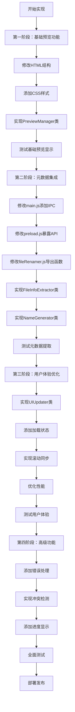
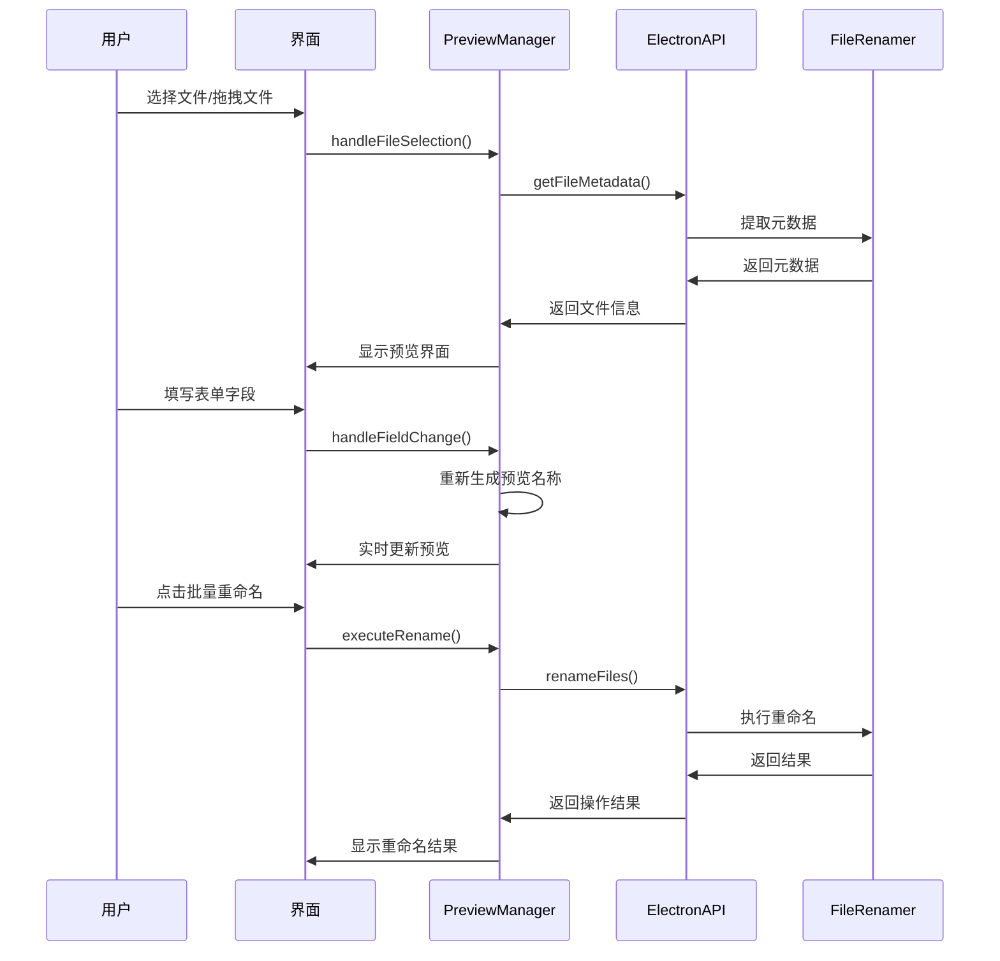
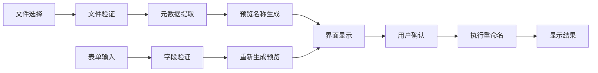
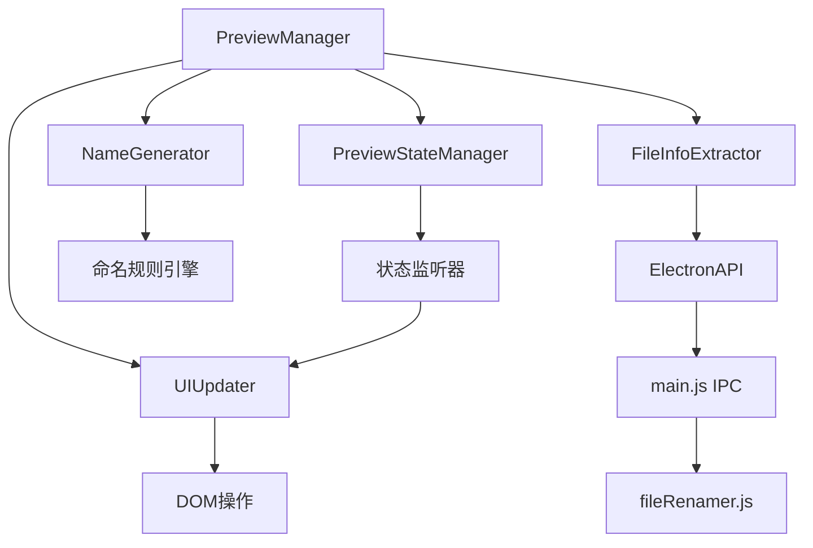
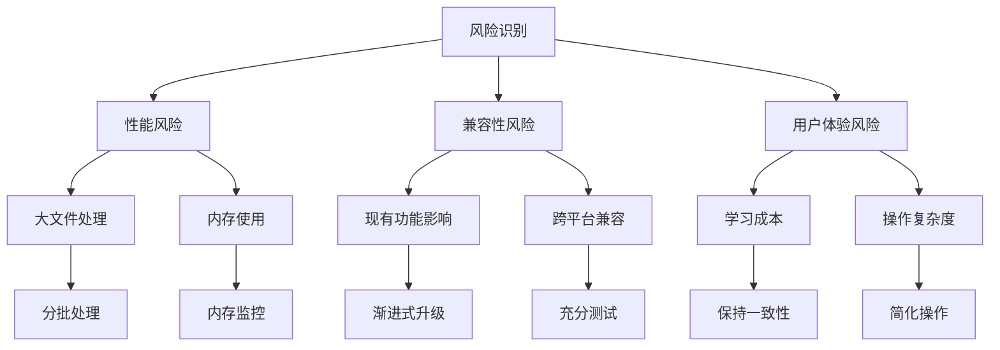

# 预览界面实现流程图

## 整体实现流程

## 用户操作流程

## 数据流转图

## 模块依赖关系

## 关键实现步骤

### 步骤1：准备工作
1. 备份现有代码
2. 创建新的CSS类定义
3. 准备测试文件

### 步骤2：基础结构
1. 修改index.html的预览区域结构
2. 添加预览相关的CSS样式
3. 创建PreviewManager基础框架

### 步骤3：核心功能
1. 实现文件信息提取逻辑
2. 实现预览名称生成逻辑
3. 实现界面更新逻辑

### 步骤4：集成测试
1. 测试文件选择功能
2. 测试实时预览更新
3. 测试批量重命名功能

### 步骤5：优化完善
1. 性能优化
2. 错误处理
3. 用户体验优化

## 风险控制点

## 成功标准

### 功能标准
- ✅ 文件选择后自动显示预览
- ✅ 表单字段实时更新预览名称
- ✅ 左右分栏清晰对比原名和新名
- ✅ 批量重命名功能正常工作

### 性能标准
- ✅ 100个文件内响应时间 < 2秒
- ✅ 界面更新延迟 < 100ms
- ✅ 内存使用增长 < 50MB

### 用户体验标准
- ✅ 操作流程直观易懂
- ✅ 错误信息清晰明确
- ✅ 界面响应流畅
- ✅ 与现有功能无缝集成

这个实现流程图为开发团队提供了清晰的实施路径，确保预览界面功能能够按计划顺利实现。